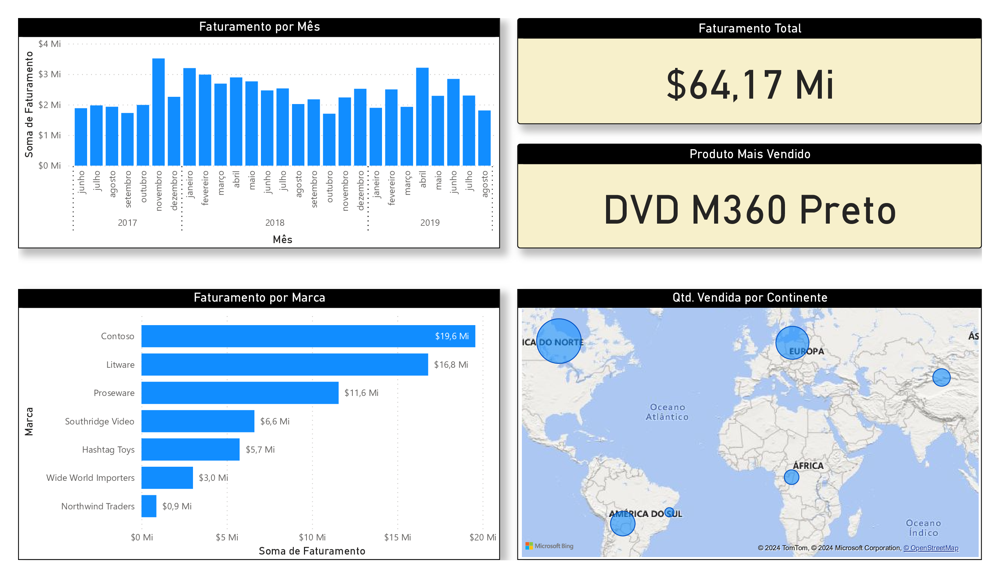
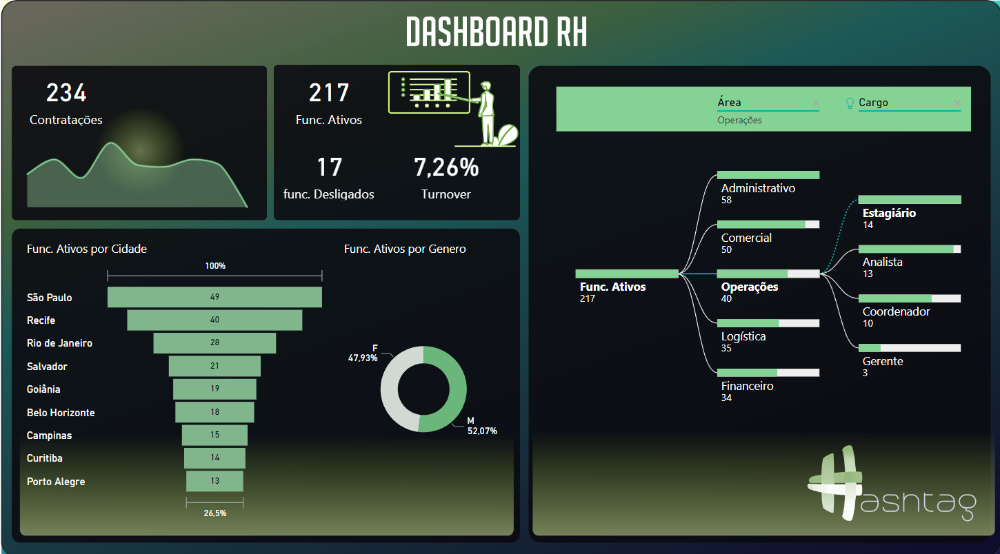
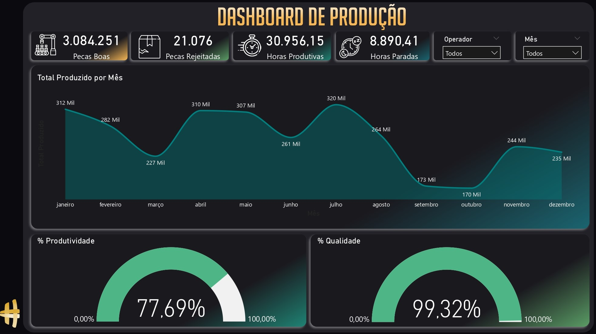
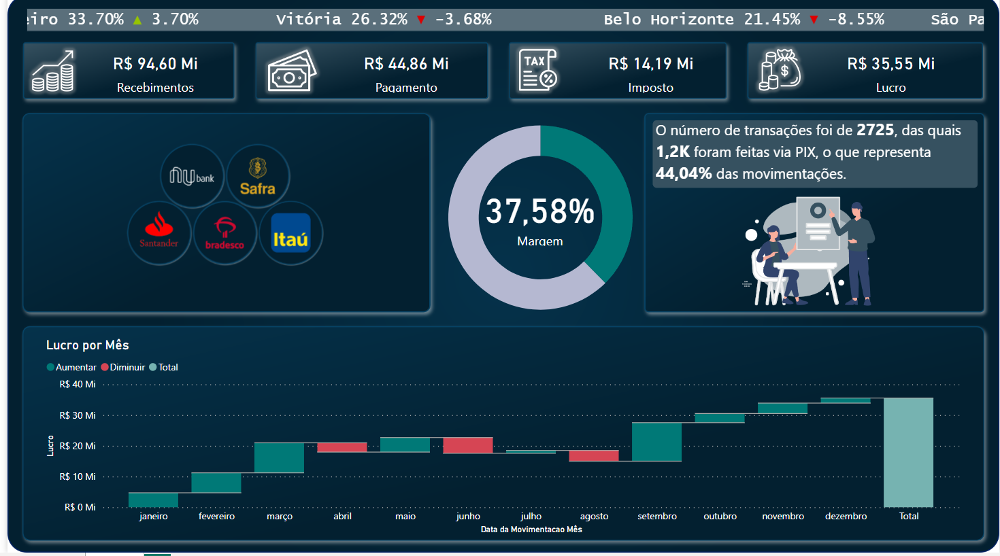

# Meus Projetos do Intensivo de Power BI

Bem-vindo ao meu repositório de projetos do Intensivo de Power BI! Aqui você encontrará uma coleção de projetos e exercícios que desenvolvi durante o curso, juntamente com recursos adicionais para ajudar na minha jornada de aprendizado em Power BI.

## Sobre

Este repositório contém uma variedade de projetos que desenvolvi como parte do Intensivo de Power BI. Cada projeto foi uma oportunidade de aplicar e consolidar os conceitos e técnicas que aprendi durante o curso.

## Projetos

- **Base de Vendas**
  - Descrição: Análise de vendas mensais de uma empresa, utilizando gráficos para identificar tendências e padrões.
  - Imagem: 

- **RH**
  - Descrição: Análise de dados do departamento de Recursos Humanos, focando em indicadores-chave de desempenho.
  - Imagem: 

- **Produção**
  - Descrição: Análise de dados do setor de produção, destacando métricas de eficiência e produtividade.
  - Imagem: 

- **Financeiro**
  - Descrição: Análise financeira da empresa, abordando aspectos como Recebimentos, impostos e análise de lucro.
  - Imagem: 

## Contato

Se estiverem interessados em conversar comigo sobre oportunidades profissionais, por favor, enviem-me um e-mail ou conectem-se comigo através do meu LinkedIn.

